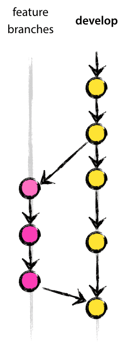

# Repo for 3900-project course docs and code

#### Repo Structure

Branch | Description | Deleted?
------ | ----------- | --------
*master* | Release branch | No
*develop* | Feature integration branch | No
*feature-[name]* | Dev work in progress | Yes

#### Repo Guidelines:

1. Don't push to *master*.
1. Don't push to *develop*.
1. Features branch from and merge to *develop*.
1. Begin weekly sprint by rebasing *develop* onto *master* and then *feature* onto *develop*.
1. Code reviews (+1) are required for:
    1. merging a *feature* branch into *develop*
    1. merging *develop* into *master*

#### Git workflow

- *feature-1* is branched from *develop* by dev1
- *feature-1* is checked out by dev1
- *feature-2* is branched from *develop* by dev1
- *feature-2* is checked out by dev2
- dev1 does work on *feature-1*
- dev1 adds, commits, pushes work to *feature-1*
- dev1 creates pull request for *feature-1* --\> *develop*
- dev2 reviews pull request and gives +1 if it is approved
- *feature-1* is successfully merged into *develop*
- dev2 rebases *feature-2* onto develop
- now *develop* and *feature-2* both have the changes from *feature-1*
- *feature-2* is still the only branch with changes from *feature-2* 

#### Visuals

Rebasing

Develop and Master

Feature and Develop

#### Learn

[Merging vs Rebasing](https://www.atlassian.com/git/tutorials/merging-vs-rebasing#the-golden-rule-of-rebasing)

[Basic Git Commands](https://confluence.atlassian.com/bitbucketserver/basic-git-commands-776639767.html)

[Git Docs](https://git-scm.com/docs)